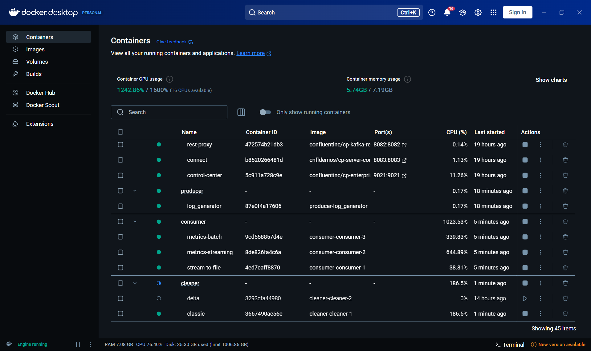

# 🧹 Spark Delta Lake Cleaner & Data Pipeline

Ce projet met en place un pipeline complet d’intégration, traitement, et nettoyage de données utilisant **Apache Spark**, **Delta Lake**, et **cron**. L’ensemble tourne dans un environnement Dockerisé avec une architecture en modules : `producer`, `consumer`, `cleaner`, et un `data_lake` structuré.

---


## 🗂️ Arborescence du projet
```bash
.
├── cleaner/ # Script de nettoyage/traitement périodique
├── consumer/ # Lecture / agrégation / monitoring (batch + streaming)
│ └── components/ # Modules Python internes
├── producer/ # Simulation ou ingestion de logs
├── data_lake/ # Répertoire Delta Lake (stockage structuré)
│ ├── delta/ # Logs fusionnés (delta_lake)
│ ├── logs/ # Logs bruts Spark
│ │ └── _spark_metadata/
│ ├── logs_to_merge/ # Logs en attente de traitement
│ ├── merged/ # Logs fusionnés (classic)
│ └── metrics/ # Dérivés statistiques
│   └── batch/ # données batchs
│     ├── agent/
│     ├── daily/
│     └── ip/
│   └── streaming/ # données streaming
│     ├── agent/
│     ├── daily/
│     └── ip/
│
├── log/
│ ├── cron/ # Logs générés par cron
│ └── writer/ # Logs du writer/producer
```

---

## 🚀 Objectif du projet

- Simuler la production de logs
- Stocker les données dans un **Data Lake Delta**
- Mettre en place un traitement **batch** et **streaming**
- Nettoyer et agréger les données périodiquement (via `cron`)
- Assurer la traçabilité via des **logs persistants**

---

## ⚙️ Composants clés

### 🏭 `producer/`
- Simule ou produit des événements (logs avec IP, timestamp, etc.)
- Écrit dans `data_lake/logs_to_merge/` en format Parquet ou JSON

### 📥 `consumer/`
- Lit les logs bruts ou agrégés
- Applique des transformations via Spark
- Gère des métriques par `agent`, `ip`, `daily` dans `/metrics/streaming/`

### 🧹 `cleaner/`
- Exécute un job Spark toutes les minutes (ou selon fréquence configurée)
- Lit et nettoie les fichiers de `logs_to_merge/`, les fusionne dans `merged/`
- Enregistre des traces dans `log/cron/`

---

## 🧾 Exemple de traitement dans `cleaner/delta_lake.py`

```python
from pyspark.sql import SparkSession
from datetime import datetime

spark = SparkSession.builder \
    .appName("DeltaLakeCleaner") \
    .getOrCreate()

input_path = "/app/data_lake/logs_to_merge"
output_path = "/app/data_lake/merged"

df = spark.read.format("parquet").load(input_path)

df_clean = df.dropna().dropDuplicates()

df_clean.write.format("delta").mode("append").save(output_path)
